# Dragon Mountain Ruins - Interactive 3D Graphics Scene


<p align="center">
  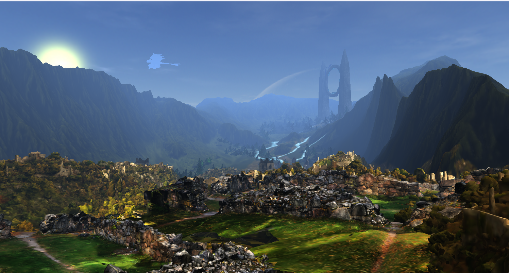
</p>


## Description

This project implements an interactive 3D graphics scene using OpenGL.  
The application renders a fantasy mountain landscape containing ancient ruins, forests, a glowing portal and a flying dragon (Toothless, my favourite character, from 'How to Train Your Dragon' the movie). The user can freely explore the environment in real time using keyboard and mouse controls.  
The goal of the project is to demonstrate modern computer graphics techniques such as lighting models, shadow mapping, fog effects and a programmable rendering pipeline.


## Features

- Real-time interactive 3D scene
- Dynamic camera movement
- Multiple rendering modes (Solid, Wireframe, Polygon)
<p align="center">
  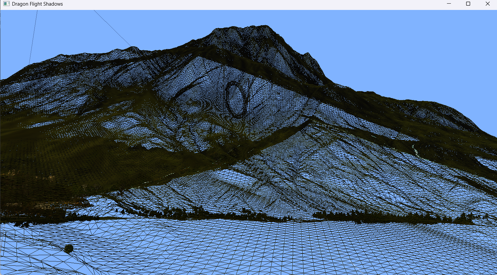
  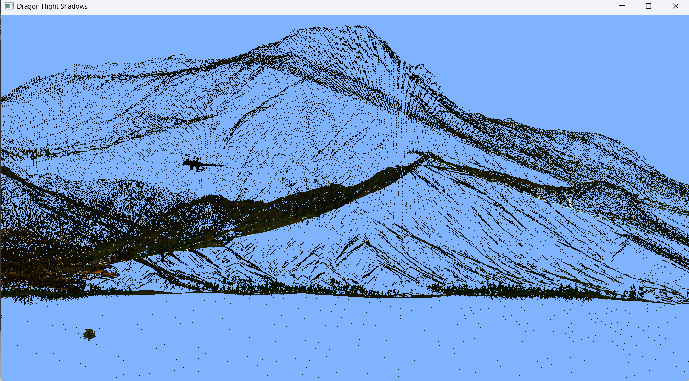
</p>

- Directional lighting (sun)
- Portal local light source
<p align="center">
  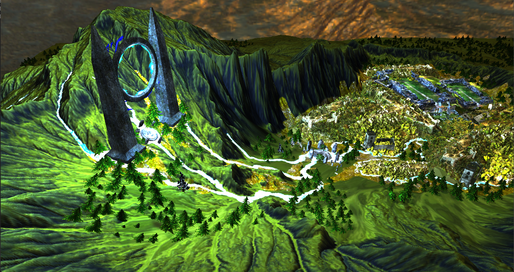
  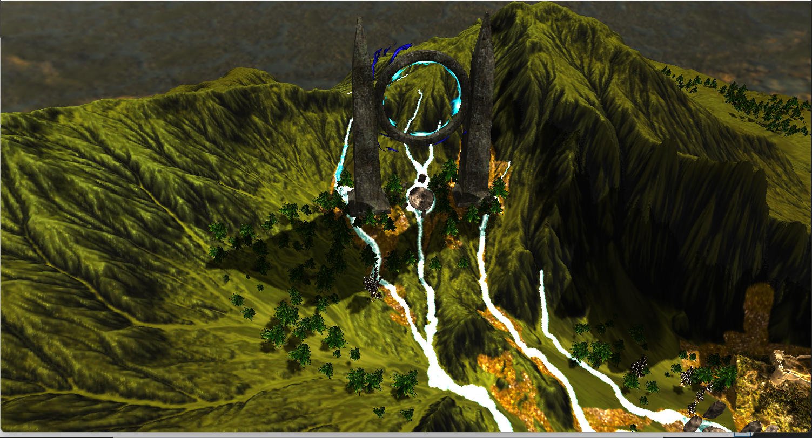
</p>

- Real-time shadow mapping
<p align="center">
  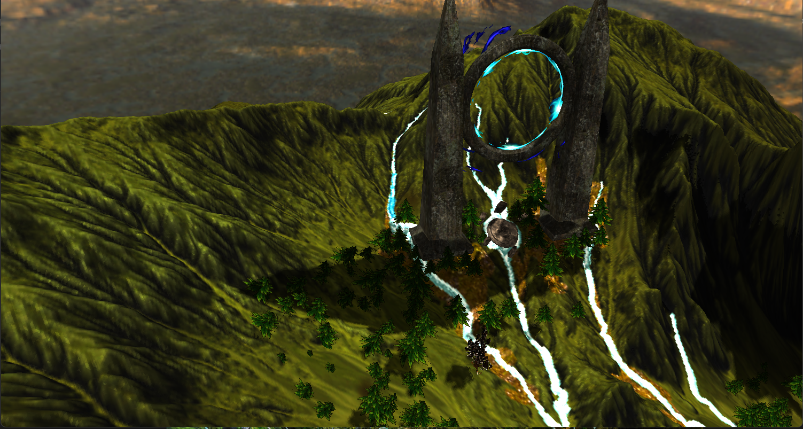
  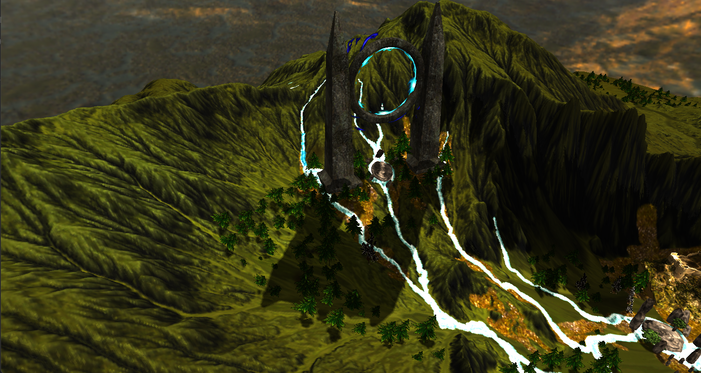
  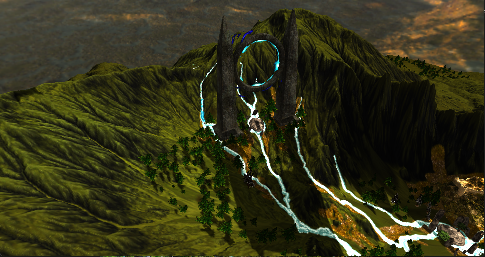 
</p>

- Exponential fog effect
- Cinematic camera mode


## Technologies

- C++
- OpenGL
- GLFW
- GLM
- TinyOBJLoader
- Blender (for 3D models)


## Download

Clone the repository:
```bash
git clone https://github.com/Franci0128/Interactive-3D-Graphics-Scene.git
cd Interactive-3D-Graphics-Scene
```

Due to GitHub file size limitations, the main 3D model is hosted externally.

Download it here:
[Download Model](https://drive.google.com/file/d/1fXc50mfmBOnbs23c9qLa9Tw4VktsT20i/view)
After downloading the file, place it in the following directory:

lab8/objects/

This is the same folder that contains the other `.obj` and `.mtl` files used by the project.


## Installation

Requirements:

- C++ compiler
- OpenGL
- GLFW
- GLM
- Visual Studio or any C++ IDE

Steps:

1. Open the project in Visual Studio.
2. Build the project.
3. Run the executable.


## Usage

After launching the application, the user can explore the environment in real time.

| Key | Action |
|----|------|
| W | Move forward |
| S | Move backward |
| A | Move left |
| D | Move right |
| Mouse | Rotate camera |
| P | Toggle presentation mode (automatic camera movement when entering the scene) |
| F | Toggle fog |
| C / V | Adjust fog density |
| M | Change rendering mode |
| G | Toggle portal light |
| 8 / 9 | Adjust portal light intensity |
| Q / E | Rotate sun direction |
| 6 / 7 | Adjust global light intensity |
| H | Toggle global light |
| Esc | Close the application |


## Graphics Implementation

The project demonstrates several important real-time rendering techniques used in modern computer graphics.

### Phong Lighting

The scene uses the Phong illumination model to compute lighting per pixel in the fragment shader. This produces smoother and more realistic lighting compared to Gouraud shading.

### Shadow Mapping

Shadows are generated using the shadow mapping technique.  
The scene is rendered from the perspective of the light source to generate a depth map. During the final rendering pass, fragments compare their depth with the shadow map to determine if they are in shadow.

### Fog Effect

An exponential fog model is used to simulate atmospheric depth and improve visual realism.


## Project Structure
```
lab8/
│
├── objects/ # 3D models (.obj, .mtl)
├── shaders/ # GLSL shaders
├── skybox/ # skybox textures
│
├── Camera.cpp
├── Camera.hpp # camera implementation
│
├── Mesh.cpp
├── Mesh.hpp # mesh rendering logic
│
├── Model3D.cpp
├── Model3D.hpp # model loading (OBJ loader)
│
├── Shader.cpp
├── Shader.hpp # shader management
│
├── SkyBox.cpp
├── SkyBox.hpp # skybox rendering
│
├── stb_image.cpp
├── stb_image.h # image loading library
│
├── tiny_obj_loader.cpp
├── tiny_obj_loader.h # OBJ model loader
│
├── main.cpp # main application entry point
│
└── lab8.vcxproj # Visual Studio project file
```

## Screenshots

<p align="center">
  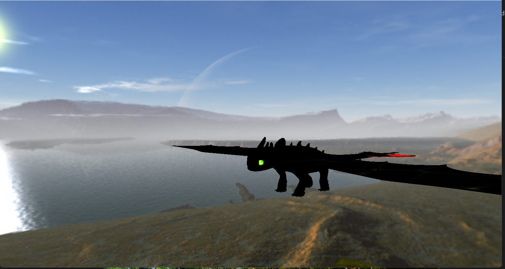
  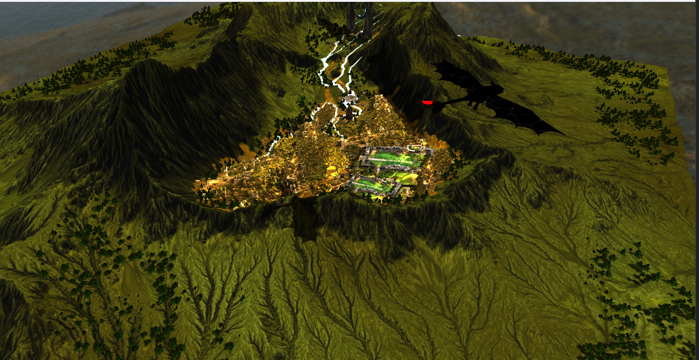
</p>

<p align="center">
  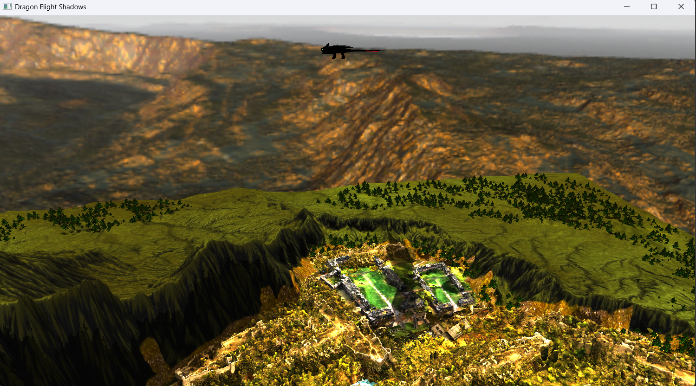
  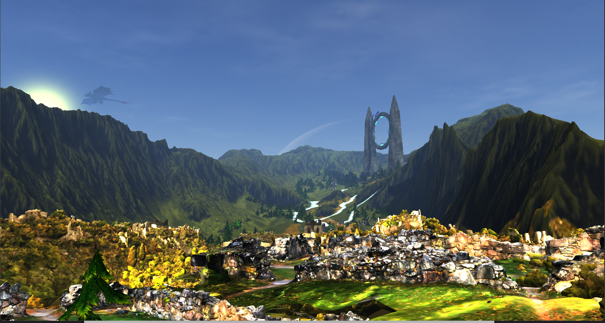
</p>


## Author
Francesca Lara Szarka  
Computer Science Student  
Technical University of Cluj-Napoca
